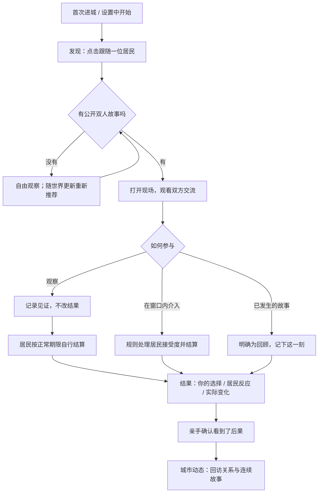

# 进城实操引导与事件结果

实现日期：2026-09-06。本轮本地功能，部署状态以交接手册和实际部署提交为准。

## 玩家体验

2026-09-06 后续优化：现场底部固定下一步操作栏；历史回顾、等待结算与当前现场明确区分；故事绑定等待服务端确认，繁忙期间的同步请求补刷。暂无故事时可进入共享住宅提议真实共餐，详见 [室友共餐纵切](SHARED_MEAL_VERTICAL_SLICE.md)。

新建世界自动出现一个可收起的引导，不增加新登录步骤，也不要求英语输入或消耗 AI 额度。已有账号不被强制弹出，可以从「设置 → 进城实操引导 → 开始 / 继续引导」进入。



- 引导卡只在城市无其他面板遮挡时显示；进入故事后提示移到故事内。展开引导时暂不同时叠加 Moment 提示，避免抢注意力。
- 候选优先级：可介入的公开双人事件 → 当前跟随居民相关 → 尚未结束 → 较新；不强制所有人上演同一段冲突。
- 玩家可以直接点地图上的居民或从城市动态打开故事，同样接入当前引导阶段。
- 旁观是有效参与方式，但「观察成功」不是「事件结算」。尚未结束时提示自由逛城，结果到来后再提醒查看。
- 结果卡在故事正文顶部，结算返回时把正文滚回顶部并聚焦结果，不再埋在长对白后方。英语台词继续使用英文和中文对照，系统提示随语言设置切换。
- 接受、回应不一、误解、拒绝、适得其反有不同表述；自主结果不冒领成玩家功劳。没有公开变化时明确说明，不编造数值奖励或泄露隐藏关系分数。
- 完成教程需要点击结果卡后的确认按钮；随后打开城市动态，继续回访生活变化。不是“所有居民从此幸福”的通关。

## 状态与数据边界

进度保存在 SQLite `player_onboarding.state_json.city_practice`，不是浏览器 localStorage。

| 字段 | 含义 |
|---|---|
| `version` / `revision` | 教程版本、服务器单调递增的元数据修订号 |
| `status` | `not_started` / `active` / `paused` / `completed` |
| `step` | `discover` / `participate` / `result` / `complete` |
| `npc_id` / `story_id` | 跟随过的居民、当前跟踪的实际故事 |
| `participation` | `null` / `observed` / `managed`，从实际故事数据推导 |
| `receipt` | 结算后的一份公开故事快照；对外作为 `story` 返回，不暴露模拟内部证据 |

`GET /api/v1/onboarding/practice` 返回 `{progress, story, candidate}`。它按正常世界时钟更新投影并核对引导，不调用 AI、不提前结算事件。

`POST /api/v1/onboarding/practice` 接受：

```json
{"event":"follow","npc_id":"某个属于当前账号的居民 ID"}
```

其余事件是 `start`、`pause`、`select_story`（需 `story_id`）、`acknowledge_result`（需匹配的 `story_id`）。客户端不能上传步骤、成功状态、结果或奖励。服务端检查世界是否建立、居民归属、故事可见性及结果证据；事务合并元数据，不覆盖其他入住信息。

观察/介入仍走 `/life-stories/{id}/observe`、`/intervene`。选项及结果由生活规则负责；教程只记录它们。介入结果增加 `selected_action_label` 和 `selected_action_label_zh`，因此刷新后仍知道选过什么，不依赖组件里的临时按钮状态。

刷新、换设备、离线后回来都恢复同一阶段。当前故事被保留策略清理且未获得结果时可重新选择故事；已获得的结果有单独快照，不会因原故事清理而丢失。重复确认不重复修改关系、记忆或资源。收起不是重置，重新开始已完成教程也不重置城市。

内测账号的原有「重置新手流程」会一并删除该进度；登录资格、邀请码规则不变。不需要额外 env、AI Key、管理端配置或手工数据库迁移。

## 验收清单

1. 新用户创建两人并入住后自动出现引导；老用户可从设置手动开始。
2. 跟随按钮确实切换地图镜头，进度进入参与阶段；刷新仍保留。
3. 有事件时推荐真实双人场景；没事件时可继续观察、收起、重试，没有假事件和假成功。
4. 观察进行中的故事只记录见证，不改变关系、资源或结算。
5. 旁观后跨越原有截止时间，展示居民自主结果，不归功于玩家。
6. 介入后展示对应双语选项、规则返回的反应和后果；负面回应不是绿色“成功奖励”。
7. 再次打开/换设备时结果与选择仍一致；重复确认不重复结算。
8. 历史场景明确是回顾；打开它不播放成“刚由你触发”的新事件。
9. 教程完成跳到城市动态；刷新不自动重播，可在设置中再次开始。
10. 窄屏结果卡不横向溢出，可滚动阅读并点击确认；支持减少动态效果偏好。
11. 非本账号居民/故事不能绑定；不能从发现阶段直接请求完成。
12. 仅对测试账号执行已有重置功能后，重新入住从发现步骤开始，无需再次兑换邀请码。

自动检查：`backend/tests/test_city_practice.py`；`npm --prefix web run check:practice`；现有全套后端测试和 Web lint/typecheck/build。

## 仍需真实试玩评估的部分

仍不保证新用户进城固定秒数内就有可介入事件，不为教学冻结模拟时间，也不凭空安排厨房争执。现在可以在共享住宅提议一起吃饭，但居民仍可拒绝、延后或因日程无法参加；教程不把提议本身当成已完成的事件。下一轮继续观察等待时间、邀请接受度、厨房场景可读性及真实结果是否容易理解。
