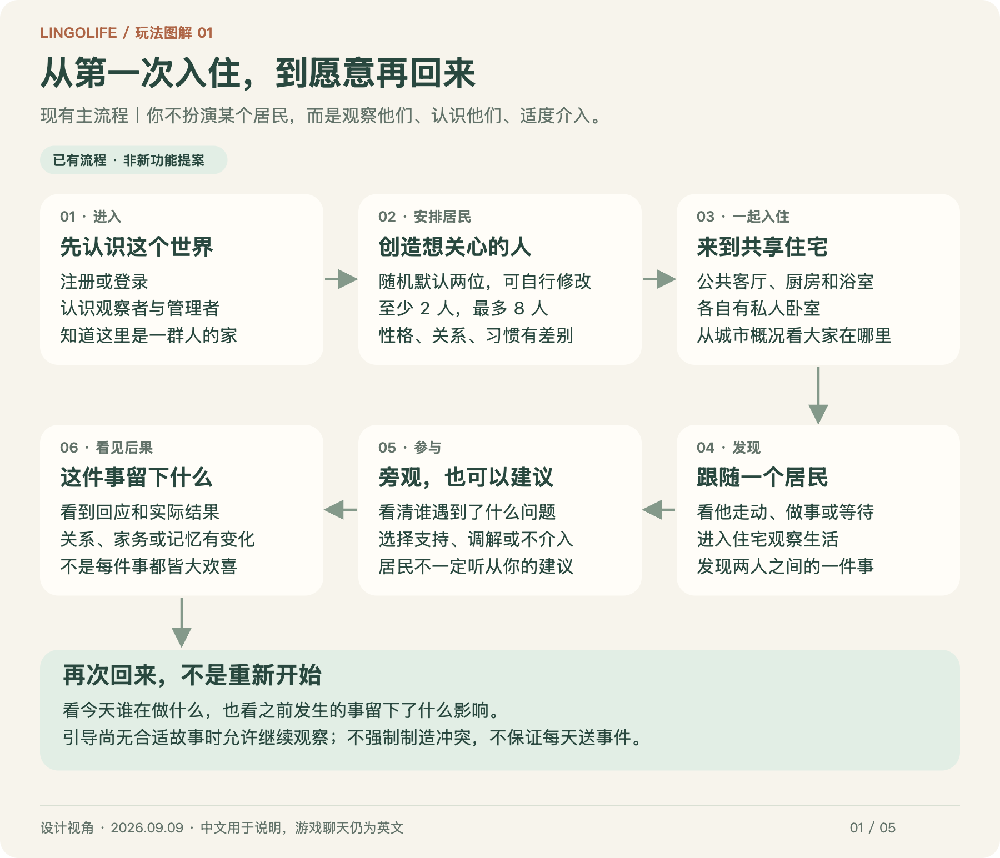
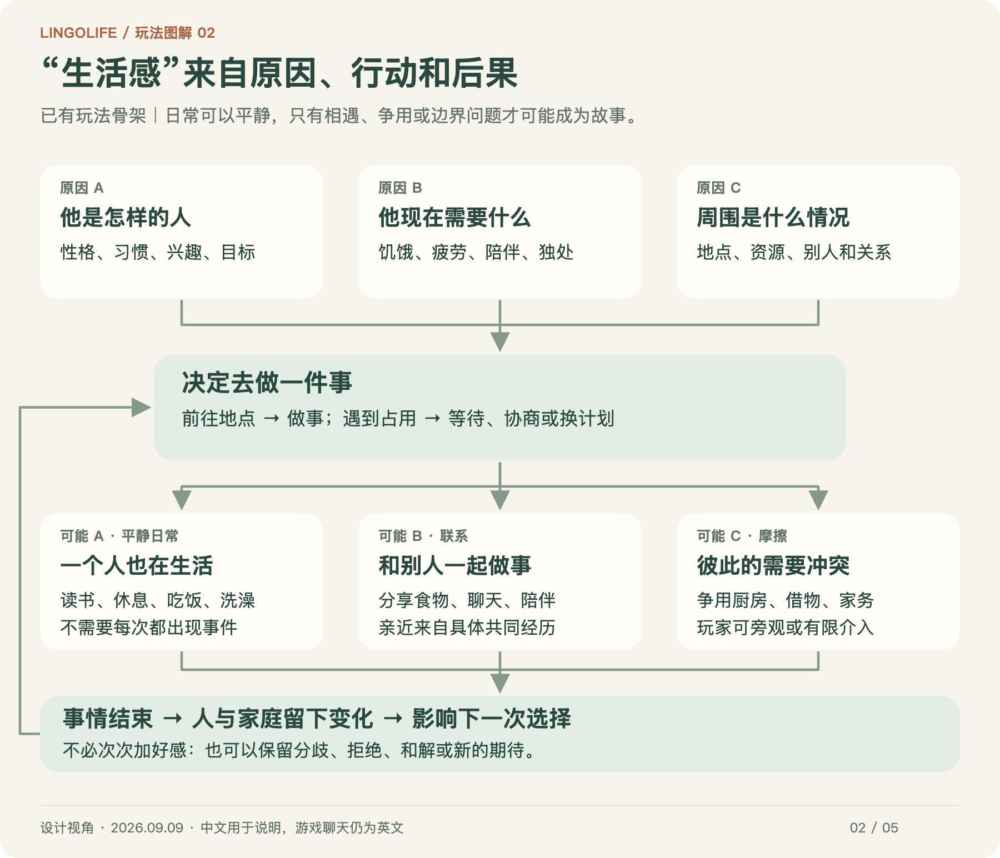
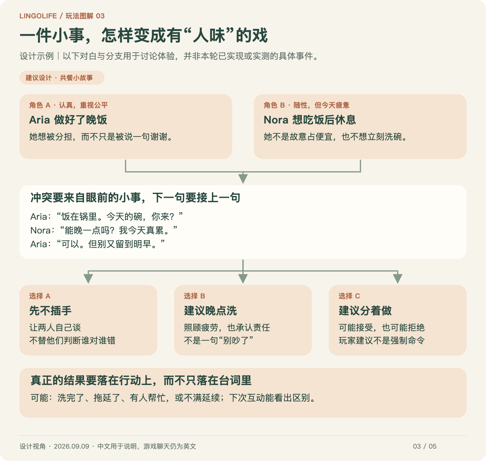
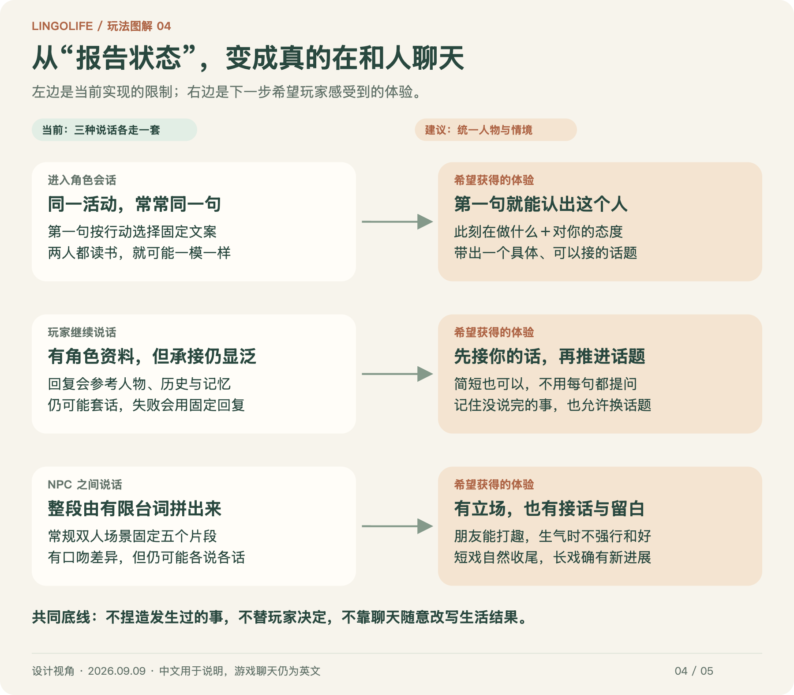
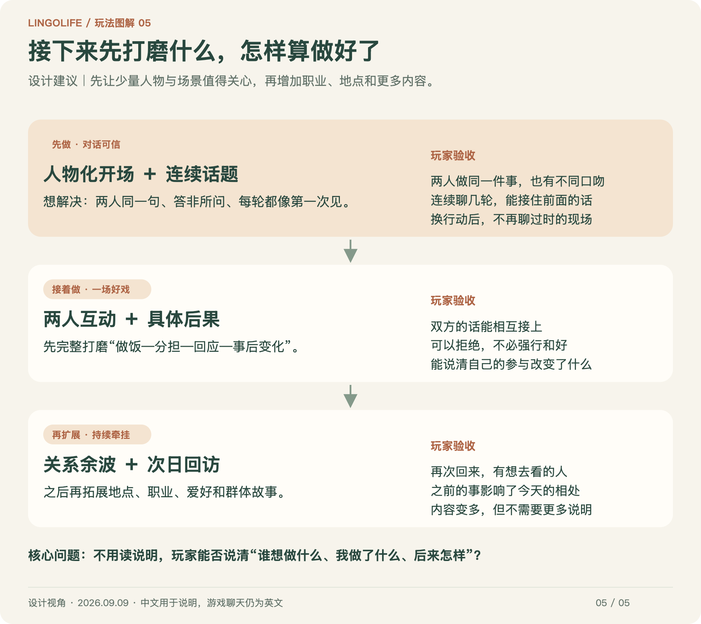

# LingoLife：玩家旅程与玩法设计图解

> 2026-09-26 本地更新：居民增加「内心设定（选填）」；事件经过各自见闻和价值评价，部分事情会留下心事，推动之后真实去找对方。对方可听取、推迟或疏远；公共做饭/清洁也能经见证者告诉第三人。看 [居民作为“人”：个人视角与持续社交](NPC_PERSON_SOCIAL_REFACTOR.md)，其中区分了已实现的生活链与下一步的丰富度设计。本轮未部署，下方旧图仍为历史设计示意。

> 2026-09-20 本地更新：创建居民时「与其他成员的关系」为选填，默认不用逐对填写。有认识的人才选择对方、添加关系或背景；亲属只填一侧，另一侧自动对应。留空时从普通同住者开始，之后自然交朋友或产生矛盾。旧账号居民不足时可以继续完成入住，原居民与历史保留，不需要清空存档。本轮未部署，下方旧图尚未更新。

> 2026-09-19 本地更新：NPC 间片段取消“记下这一刻”。居民自动形成各自对彼此的记忆；近期记得较清楚，小事淡忘，深刻经历留下大意，整体关系不随细节遗忘清零。新手引导改为“查看结果”。见 [居民怎样记住彼此](NPC_PAIR_MEMORY.md)。下方旧图未重绘，不代表新版按钮。

> 2026-09-15 本地进展：生活片段已改为“真实生活事实 → AI 编写和校对 → 双语演出 → 固定回放”；玩家介入后生成结果对应的后续，NPC 对玩家的开场也读取人设。见 [对白玩法与当前边界](NPC_AI_LIFE_DIALOGUE.md)。尚未上线；下方图片保留 9 月 9 日的现状／建议对照，不能当作新版完成截图。

图解整理：2026-09-09。现状依据已核对的应用版本 `b37d83b`，不是一次新的线上验收。本轮只整理文档和图片，**没有实现图中的建议功能**。

这份文档先回答五个问题：**第一次怎么玩？居民为什么做事？怎样产生故事？聊天为什么不自然？下一步先改什么？**

阅读方式：按顺序看下面五张图片即可。图片可以点击打开、放大；绿色或“已有”表示当前玩法，橙色或“建议”表示待讨论的设计。图内文字也有正文说明，手机端不必勉强读缩小的图。

原来的接口、提示词、数据结构和代码索引完整保留在 [技术参考](PLAYER_JOURNEY_TECHNICAL_REFERENCE.md)，不需要先读它。

## 1. 第一次进入：从认识世界，到关心一个人

**现在的流程：** 注册或登录 → 认识玩法 → 用随机默认值创建并修改居民 → 共同入住 → 跟随一人 → 观看真实故事 → 旁观或介入 → 看结果。已有账号回来时跳过已完成的入住流程，邀请码只在注册时使用。

这里最重要的不是让玩家填完一份人物表，而是让他尽快产生：“我想看看这个人接下来会做什么。”

### 玩家到底是谁

- **观察者：** 看城市概况、切换视角、跟随居民、进入住宅看生活。跟随不是操纵角色移动。
- **管理者：** 与居民说话、提出建议、在允许时介入他们之间的事。居民可以不接受，也可能理解错。
- 两种身份都不是“附身 NPC”。你影响他们的生活，但他们有自己的需要和边界。

### 初次体验的设计重点

**已有：** 初始默认两位、最多八位居民；共享公共房间和各自卧室；进城实操引导与事件结果卡。

**建议打磨：** 默认人物要容易记住且有差异，高级资料不应阻挡快速入住；玩家第一次看到的事要容易理解、能参与、有可见后果。没有合适故事时可以先观察日常，不要为了教程凭空制造一场争吵。

**验收问题：** 不看说明，新玩家能不能讲出“我认识了谁、看到了什么、我做了什么、后来怎样”？这比是否点完所有教程按钮更重要。

## 2. 居民为什么会做事：“生活”应该形成循环

**现在的骨架：** 他是什么样的人＋当下需要什么＋周围有什么条件 → 决定去做一件事 → 途中可能等待或改变打算 → 事情结束 → 需要、关系和经历影响下一步。

### 三种内容都要有，不能满城都是任务

- **平静日常：** 读书、独处、吃饭、睡觉、洗澡。没有事件标记，也可以是在正常生活。
- **共同活动：** 一起吃饭、看电视、寻求陪伴。关系可以从小事中积累，不必每次都表白或吵架。
- **摩擦与故事：** 厨房被占、物品被借走、家务无人分担。问题来自人和环境，不是为了让玩家点按钮而随机塞入。

地图与住宅应当提供“为什么会发生这件事”的理由。例如厨房容量有限、饭菜有归属、居民可能疲惫或想独处。**加建筑模型不等于增加玩法**：新增一个地点前，先想清它让居民多了什么行为机会，以及可能影响谁。

### 每次回来是什么体验

当前会继续存档、追赶离开后的变化，不会每次登录都重开生活；新的一天也不保证给每人发一个事件。不是所有离线小事都会保留为可回放的日记。

希望进一步做到：打开时先知道“大家现在在哪里”和“我离开后，有什么值得关心的变化”，而不是面对一堆无人解释的状态。回访摘要、统一关注入口仍需要打磨。

**验收问题：** 能否不看隐藏数值，只凭地点、动作和简短提示理解他为什么在这里、为什么等待、为什么不愿帮忙？

## 3. NPC 之间：用一件家常小事，演出不同的人

**这张是设计示例，不是新功能完成截图。** 共餐、清理、接受/拒绝和关系后果已有基础，但图中具体台词、完整分支和对应演出不代表已经实现。中文对白用于讨论设计，游戏内对白仍为英文并可看中文翻译。

### 一场好戏的六个要素

1. **有起因：** 饭做好了，但碗还没人洗。不是无缘无故宣布“发生了冲突”。
2. **双方都讲得通：** 一方在意公平，另一方真的疲惫；不必强行安排好人和坏人。
3. **有接话：** “能晚点吗？”应该接到“多久？”或“别再拖到明天”，而不是突然感谢、夸奖或更换话题。
4. **选择有取舍：** 照顾疲劳不等于免除责任；主持公平也可能让某人觉得不被理解。
5. **行动兑现结果：** 接受分担后真的有人去洗碗；拒绝后留下的问题不会凭一句漂亮收尾消失。
6. **留下适度余波：** 以后愿不愿主动邀约、是否仍介意家务，可以有变化；一件小事不必直接变成死敌或恋人。

### 相同场景，不同关系应当如何演（建议）

| 两人的关系 | 希望看到的区别 |
|---|---|
| 刚认识 | 更试探，对借物和玩笑保留一点距离 |
| 好朋友 | 可以省略解释、互相打趣，但不代表没有边界 |
| 最近有矛盾 | 同一句提醒容易被听成指责；不必立即和好 |
| 关系亲密 | 更熟悉对方的习惯，也更可能在意承诺是否兑现 |

这些是演出目标，不表示当前每种关系都有一套完整专属对白。友情、竞争、冲突和恋爱不是一条“好感越高越好”的单向进度条；恋爱也不是必须走向的终点。

**现状限制：** NPC 之间已有四阶段的互动现场，但常规双人对话仍由有限台词组成五个片段，容易像轮流念状态。下一步重点应是接话、立场和因果，而不是先把五句改成十句。

## 4. 玩家与 NPC：先让人想聊，再考虑聊多长

### 玩家理想中的一次聊天（建议）

**来到他身边 → 他结合眼前的事说一句 → 你顺势接话 → 他先回应你，再表达自己 → 可以继续、换题或自然结束 → 这次交流留下合适的记忆。**

一句话也能有生活感，不需要每轮都抒情、解释性格、提出新问题。有人话少，有人会吐槽，有人只想把手上的事做完；这些差异不该只体现在人物资料里。

### 目前的流程，换成玩家能理解的话

- **刚点开角色：** 第一条开场按他正在做的事选择固定句子。同样在读书的两个人，确实可能说完全一样的话；目前这里没有采用人物性格。
- **你输入后：** 正式回复会参考人物资料、关系、记忆和本次聊天；英文逐步出现，中文翻译随后补齐。回复仍可能泛泛，服务不可用时还会使用少量固定备用句。
- **离开又回来：** 同一天、同一行动继续本次会话；换行动或跨日开始新会话。旧聊天仍能回顾，但换会话本身并不保证新开场文案不重复。

### 下一步最值得补的体验

**第一句就有差异。** 同样读书，安静的人可能只分享一句感受，外向的人可能主动讲刚看到的内容；只能引用游戏真的知道的事实，不能为了生动随意编造书名或过去经历。

**接住眼前的问题。** 玩家问“为什么不想一起吃饭”，回答应该围绕这次邀请，而不是自动转成“谢谢你关心我，你今天怎么样”。

**允许边界和沉默。** 忙碌、疲惫、睡觉、洗澡和想独处应该有不同表现，不需要随时准备长聊，也不应把拒绝设计成惩罚玩家。

**表情与话意一致。** 无奈可以是一个停顿或叹气，不必大笑；真有不同看法，可以不微笑着夸奖玩家。不能只靠气泡动画掩盖台词不接上下文的问题。

**验收问题：** 遮住姓名，能不能从连续几轮聊天认出两人的区别？前后几句话能不能连成一个话题？

## 5. 下一轮先优化什么

这张图是下一步建议，不是历史 P0/P1 的完成清单。

**先做：人物化开场＋玩家聊天承接。** 直接解决“两个 NPC 开场一样”和“说话不自然”。每项同时准备正常体验与服务不可用时的体验，避免故障变成反复套话。

**接着做：一个完整双人生活场景。** 优先使用已有厨房与共餐基础，完整打磨从做饭、邀请、分担到事后变化的体验。朋友、陌生室友、有矛盾的两人都能演，但不要求每次强行升级成大事件。

**再做：让我想明天回来。** 用具体经历解释关系变化，再逐步扩展职业、爱好、地点和多人故事。英语学习与付费额度不是本轮玩法设计的主线，不需要靠增加学习任务来填补生活内容。

## 6. 打开游戏后，去哪里看这些设计

| 我想做什么 | 现有入口 | 设计上应避免 |
|---|---|---|
| 看大家现在怎样 | 城市概况、居民列表 | 只有抽象状态，看不出发生了什么 |
| 看一个人生活 | 选择跟随；进入对应建筑或共享住宅 | 室内居民又出现在室外，或点击后找不到人 |
| 看他们之间的事 | 城市动态、互动现场 | 不知道缘由、双方立场和是否还能介入 |
| 与某人相处 | 交谈、翻译、历史回顾 | 开场重复，或强行延续上一行动的旧话 |
| 看经历留下什么 | 结果卡、关系、角色生活档案 | 只有数值，没有具体变化的解释 |
| 调整人物和偏好 | 角色工作室、设置 | 选项过多，核心操作藏得太深 |

观察是玩法的一部分，不是等待对话的空档。普通浏览与居民自主生活不需要玩家每次都消耗 AI 聊天额度；管理端编辑布局也不等于普通玩家可以随意控制一切。

## 7. 下次试玩，只记这五件事

1. 我能否快速选出一个想关注的居民？
2. 我看得懂他在做什么、为什么这样做吗？
3. 一件双人事件里，两人的话能接上吗？
4. 我的选择有可见后果吗？拒绝或不插手是否也讲得通？
5. 离开时，我有没有想下次回来继续看的事情？

记录格式：**我在哪里 → 我期待什么 → 实际发生什么 → 希望怎样改变。** 附上相关居民、时间与截图即可，不需要先分析代码。需要测试首次入住时使用专门测试账号；不要为试玩重置日常账号。

---

### 延伸阅读与图片源文件

- [技术参考：原完整流程、提示词、数据与代码索引](PLAYER_JOURNEY_TECHNICAL_REFERENCE.md)
- [进城实操引导](CITY_PRACTICE_GUIDE.md) · [共餐完整场景](SHARED_MEAL_VERTICAL_SLICE.md) · [室内生活表现](HOUSEHOLD_LIFE_PRESENTATION.md)
- [双设备开发交接](SESSION_HANDOFF.md) · [GDD](../LingoLife%20GDD.md)
- 图片在 [images/player-journey](images/player-journey/)：PNG 便于直接阅读，SVG 可无损放大。文字与布局源文件为 [render-player-journey.mjs](scripts/render-player-journey.mjs)，生成说明见该目录 README。
