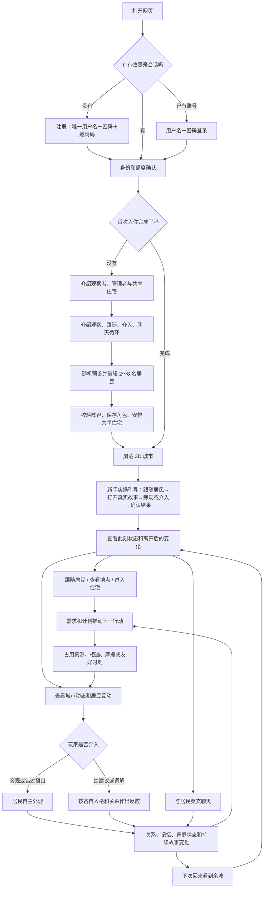
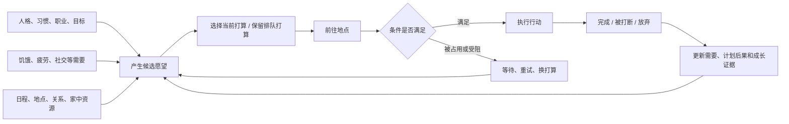
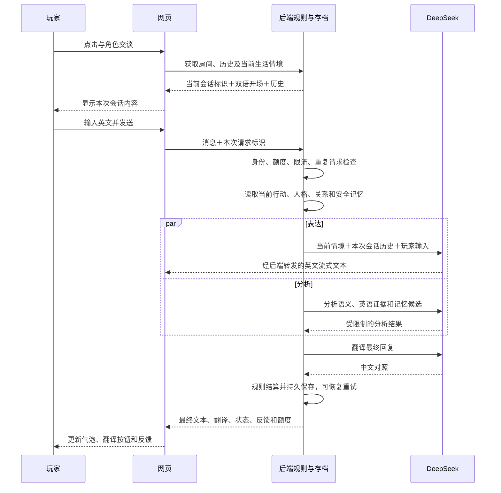
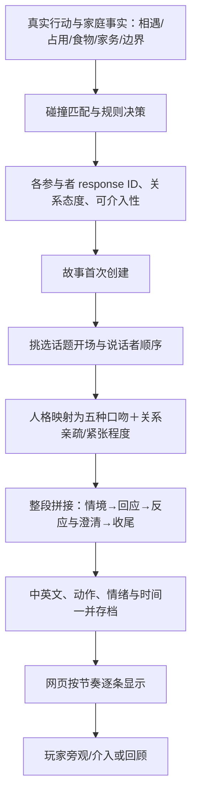

# 玩家旅程与会话系统：技术参考

> 2026-09-15：最新本地生活片段与开场实现见 [NPC AI 生活对白](NPC_AI_LIFE_DIALOGUE.md)。本文件下方关于纯模板片段／开场的说明是历史审查，不是最新本地链路。玩家正式回复的流式表达、分析和翻译链路仍保留。

> 2026-09-09 从原主文档完整保留的参考资料。优先阅读 [玩家体验图解](PLAYER_JOURNEY_AND_SYSTEMS.md)；本文件用于开发定位，不需要先读懂代码才能讨论玩法。下文的实现核对与历史措辞保留其 2026-09-07 时间点含义，后续优先级以图解主文档为准。

核对日期：2026-09-07。面向产品设计与逐项试玩，按当前代码整理，不把 GDD 的目标功能当作已实现功能。应用版本 `b37d83b` 已发布，会话隔离、进城实操引导与结果卡包含在该版本中；发布记录见 `SESSION_HANDOFF.md`。本次追加的是会话生成链路审查，仅修改文档，没有修改提示词、台词或线上行为。

## 1. 先看游戏里三条相连的线

你可以用三条线理解现在的 LingoLife：**居民自己生活、你观察或介入、经历留下后果**。英语聊天是你接近居民的一种方式；它不是整个世界的发动机。



图中的“加载城市”包含素材和 3D 场景准备。实际请求会并行执行，图按玩家理解顺序绘制。

## 2. 第一次打开：玩家逐步经历什么

| 步骤 | 玩家看见、可以做什么 | 系统实际在做什么 | 目前值得注意的体验问题 |
|---|---|---|---|
| ① 打开网页 | 品牌加载画面，随后进入登录或游戏 | 区分玩家/管理域名；恢复本机保存的登录令牌，向服务器验证身份 | 加载有多个阶段；玩家不一定知道在等待身份还是素材 |
| ② 注册或登录 | 注册填用户名、密码、邀请码；老用户填用户名、密码 | 注册消耗一次邀请码；用户名不区分大小写保证唯一；密码保存为哈希；返回登录会话及额度 | 邀请码只在注册使用。账号登录失败、网络错误、限流是不同原因，反馈仍值得统一优化 |
| ③ 介绍身份 | 认识观察者、管理者，以及所有人共住的住宅 | 确认介绍后将确认状态保存到服务器 | 这是说明页面，不是可操作教程 |
| ④ 介绍生活循环 | 阅读“观察→跟随→旁观或介入→交流”的说明 | 切到玩法介绍页面 | 玩家读过不代表已经知道地图上怎么操作 |
| ⑤ 创建首批居民 | 默认出现 2 名有差异的预设；可增加至 8 人、编辑或重新随机 | 默认方案来自 12 个原型；检查姓名、年龄、性格等字段与阵容差异 | 当前填写项较多。**提交前草稿主要保存在页面内存，刷新可能重新生成并丢失编辑**；已确认介绍仍可恢复 |
| ⑥ 设置人物关系 | 可填写亲属、共同过去、恋爱资格与边界 | 亲属必须同属阵容并互相对应；共同历史保存为过去经历 | “共同历史”只提供故事起点，不保证以后成为朋友或恋人 |
| ⑦ 确认入住 | 点击完成，等待进入城市 | 通过服务端校验后保存整组角色、共享家庭、住宅归属与私人房间；处理重试恢复 | 新账号少于 2 人不能进入正式世界；最多 8 人。个别历史兼容账号可能例外 |
| ⑧ 城市初见 | 天空之城、人物状态列表，以及右下角的实操引导 | 首次创建世界时启用账号级引导；跟随居民后推荐一件真实的双人故事 | 引导可收起，不强制锁定操作；没有双人故事时明确提示继续观察，不制造冲突 |
| ⑨ 亲手参与 | 打开现场看交流，点击观察或选择一种帮助方式 | 仍使用原有观察/介入接口；旁观不改变结算，介入由规则处理接受程度 | 已发生的故事明确为回顾；可介入窗口仍按正常时间到期，不为教程冻结世界 |
| ⑩ 看见后果 | 结果卡集中展示选择、居民反应、实际变化；确认后回访城市动态 | 服务端核对真实结算并保存一份公开结果快照，确认才完成教程 | 旁观中的事件没结束时不能提前宣称完成；拒绝、误解和适得其反不包装为成功 |

当前用户名规则为 3～32 位英文字母、数字、下划线或短横线；密码无需混合大小写等格式，但有长度限制。以上是账号规则，居民姓名另有独立校验。

新手创建界面能改姓名、职业、性格、兴趣、目标、喜恶、习惯、边界、家务、亲属与共同历史等。完整外观选项主要在后续角色工作室中编辑；使用的是批准的素材和预设，不能上传任意 3D 模型。

## 3. 进城后所有主要入口

| 玩家入口 | 能看到什么 | 能改变什么 | 不能据此推断什么 |
|---|---|---|---|
| 地图与左上居民列表 | 当前活动、位置、公开状态和待处理线索 | 选择跟随对象、调整镜头 | 镜头跟随不会变成操纵角色移动 |
| 微缩/俯瞰/跟随视角 | 同一个世界的不同观察距离 | 观察方式 | 不是三套模拟，也不会因切换镜头重新生成事件 |
| 点击地图建筑 | 地点名称、简介、对应图片、在场居民 | 查看地点或进入角色会话 | 建筑图标丰富不等于每个建筑都有独立玩法 |
| 共享住宅 | 公共房间、私人卧室、居民和共享资源状态 | 观察及选择居民继续跟随 | 普通玩家不能像管理端一样自由拖动家具、改布局 |
| 城市动态 | 值得留意的事件、近期生活片段、连续故事、昨日余波、公开关系 | 打开故事、观看现场、在允许时介入 | 没有提示标志不代表没有行动；有些问题不会向玩家披露 |
| 与角色互动 | 英文聊天、中文对照、历史回顾、地点背景 | 说话、提问、表达支持；形成与玩家相关的记忆和关系证据 | 每句自由文本建议并不一定变成 NPC 的一条可执行指令 |
| 角色工作室 | 角色设定和已接入的外观选项 | 修改资料；人数未满时新增居民 | 修改性格不会重写已经发生的历史事件 |
| 角色生活档案 | 公开的角色状态、目标、记忆与成长线索 | 查看档案、删除允许删除的记忆 | 不会把内部精确需求、所有隐藏感情或全部私人记忆展示出来 |
| 进度 | 英语知识点掌握、推荐与复习内容 | 查看学习情况 | 这不是统一的“整个游戏进度”，也不是居民长期生活目标总览 |
| 设置 | 界面语言、朗读、画面质量、密码、进城实操引导 | 修改偏好、账号密码，或开始/继续教程 | 语言/画面等部分偏好存在本机；实操引导进度在账号存档中跨设备同步；英语对白不随界面变成中文 |
| 退出登录 | 返回登录界面 | 结束当前登录会话 | 不会清除云端角色、关系和存档 |

目前入口确实较多，而且“城市动态”“角色档案”“学习进度”承载不同类型的信息。后续优化可首先统一它们的名称和职责，避免把一切都塞进同一个面板。

## 4. 居民怎样自己生活

### 4.1 行动选择



当前有 13 类基本生活行动：准备食物、吃东西、睡觉、洗澡、看电视、读书、投入爱好、借用家庭物品、清洁公共空间、留下餐具、独处休息、寻找陪伴、与室友交谈。

“去上班”“个人目标”目前更多通过日程约束、地点选择、活动倾向和目标证据表现；尚不是每个职业都有完整的工作任务、收入和升职系统。状态写着“投入兴趣或目标”，也不意味着背后已经存在一套独立职业玩法。

行动分为准备、赶路、执行、受阻、重试及结束等阶段。**阶段变化与进入下一条行动不是同一件事**：比如去图书馆读书、抵达并开始阅读，可以属于同一条行动；稍后决定吃饭才是下一条。

### 4.2 时间与刷新

- 游戏日以服务器的游戏时区划分，默认 `Asia/Shanghai`；不以玩家电脑所在时区为准。
- 浏览器依据下一次行动转换时间更新世界，另有约 30 秒的可见页面刷新兜底；切回页面、恢复联网和完成互动也会触发刷新。
- 服务器收到世界相关请求时，按权威时间推进需要发生的行动并保存结果。这是按请求推进和离线追赶，不是每个玩家都有一个永远运行的后台房间进程。
- 离线后再次访问，会追赶过去的生活变化；引擎设有最多 31 天的追赶范围和相应压缩处理，不保留无限精细录像。
- “进入新的一天”不保证送一个新事件。**事件来自居民行为与环境的碰撞**，不是每日事件配额。

### 4.3 住宅和城市为什么会影响事件

厨房、电视和浴室是三类主要共享资源。容量、占用、排队和使用偏好让居民互相影响；脏餐具、食物归属、借物和家务也会留下事实。

城市建筑及道路布局影响目的地、旅行路线与耗时；建筑类型和地点语义决定首批读书、吃饭等行为机会是否可用。但任意新建筑都有任意新能力的通用机制尚未完成。不能只增加一栋模型就认为新增了一种深度玩法。

## 5. NPC 之间怎样出现故事

普通活动可以一直是普通活动。发生资源争用、相遇、责任失衡或边界碰撞时，系统才会选择适合的场景和反应。

| 层级 | 直观例子 | 玩家通常如何接触 |
|---|---|---|
| 日常背景行动（Ambient） | 一个人安静看书 | 地图状态、动作、住宅观察 |
| 生活片段（Moment） | 两个人一起看电视或分享食物 | 生活提示、城市动态、互动现场 |
| 值得介入的事件（Incident） | 抢占资源、脏餐具导致争执 | 角色愿意披露的提示、城市动态和有限介入窗口 |
| 连续故事（Thread） | 家务分配反复引起矛盾，后来缓和或升级 | 持续故事、后续关系和次日余波 |

同一个事实会因人格、关系、主观记忆和稳定随机因素出现不同反应。稳定随机的含义是有多样性，但重复刷新不会重新抽取同一次事件的结果。

当前 NPC–NPC 现场是规则生成并保存的四阶段双语场景：建立情境→交流→反应→收尾，至少 5 个对话片段，双方至少各两句，并带动作提示。**这些对话来自有限内容库，不是两个 DeepSeek Agent 不断自由对话**。增加了句数并不自动保证自然，后续仍需要按场景打磨内容与节奏。

具体台词如何拼接、为什么仍显得生硬，以及它和玩家聊天的区别，见第 6.1～6.8 节。

玩家可以旁观，或在窗口开放时选择情境相关的管理动作。每个 NPC 独立决定接受、稍后接受、拒绝、误解或反效果；双方反应可能不同。没有介入或错过窗口时，居民会自行处理，不永远停在“等待玩家”。

结果写入方向性的关系、主观记忆、家庭事实和连续故事。A 对 B 的感觉可以与 B 对 A 不同；友情、冲突、竞争、恋爱也可以属于不同频道。恋爱受年龄、亲属、偏好及双方边界限制，不是好感满了自动升级。

已结算场景是历史回放。下次查看同一个故事仍然看到当时发生的内容，这是合理的；它与下一节“角色此刻说什么”的会话开场不同。

## 6. 玩家与 NPC 聊天的完整流程



这是配置 DeepSeek 时的主要链路；接口故障时有规则兜底。流式文字先到达，中文翻译和最终状态通常稍后随最终结果到达。表达、分析、翻译可能是多个模型请求，不能用“玩家发了几次消息”直接推断模型调用成本。

AI 看得到的是允许披露的角色资料、当前行动、关系阶段、相关记忆、近期摘要和英语目标。隐藏状态不会全部暴露。AI 提供语义判断和表达；关系、心情、XP 等变化由规则层结算。

### 本轮修正：跨日或下一行动时换会话

| 情况 | 开场和近期 AI 上下文 | 历史与长期记忆 |
|---|---|---|
| 同一天、同一条行动，离开后再次交谈 | 接着本次会话的最后一条 NPC 回复 | 保留 |
| 同一天进入下一条行动，即使仍是同一种活动 | 新开场；不把前一行动的逐条消息接到 AI 的当前对话中 | 保留，可通过历史回顾查看 |
| 跨游戏日，即使原行动仍在继续 | 新开场和新的近期会话 | 保留 |
| 同一行动从赶路变为执行或等待 | 不仅因阶段变化就重开对话 | 保留 |
| 浏览器一直开着聊天页 | 收到世界更新后刷新当前会话；有发送/待重试请求时先保留该请求，结束后再同步 | 输入草稿保留 |
| 更新前保存的消息没有会话标识 | 只作为历史，不猜测它属于当前行动 | 保留 |

开场基于当前可公开行动生成，带英文和中文；无需额外调用 AI。睡觉、洗澡等私密行为用“需要一点私人时间”表达。现阶段开场是简短状态模板；更丰富的角色化开场属于下一步内容优化。

历史检索当前房间接口最多返回最近 200 条；网页“更早记录”是在这个范围内折叠/展开，不是无限历史分页。这也是后续需要单独规划的功能。

### 6.1 先分清：你看到的“角色说话”有四个来源

**目前不是所有气泡都由 AI 生成，也没有一套统一的会话导演负责所有说话。** 修改 DeepSeek 提示词，只会影响其中一部分。

| 玩家看到的内容 | 当前生成者 | 使用角色设定的程度 | 何时重新生成 |
|---|---|---|---|
| 点开 NPC 后、还没发消息时的第一句话 | `conversation_opening()` 的固定双语模板，不调用 AI | 只读取公开行动类型、行动阶段、是否私密；不读取姓名、性格、关系、记忆 | 新游戏日或新行动标识产生新会话；但新会话可能选中同一句模板 |
| 玩家输入后 NPC 的正式回复 | 配置可用时使用 DeepSeek；失败走规则兜底 | 正常链路使用人物契约、关系阶段、公开生活情境、记忆、摘要及当前会话历史 | 每条未命中幂等缓存的新请求 |
| 两个 NPC 的互动现场 | 规则先选反应，再从双语台词库组装整段场景，不调用 DeepSeek | 人格影响反应决策；表达层主要压缩为五种口吻，结合关系亲疏、紧张程度及话题 | 故事首次创建时整段生成并存档；打开现场是播放，不是实时生成 |
| 共餐面板的邀请、接受、等饭、吃完、洗碗等短句 | 共餐状态机＋`meal_line()` 台词库，不调用 DeepSeek | 根据当时状态决定是否参加，表达按保存的口吻分类选句 | 共餐阶段和真实行动推进时新增记录 |

这里还保留旧随机事件系统的兼容代码；**生活模拟主流程使用 `current_life`，不是每天给每个 NPC 分配一个旧事件脚本再聊天。** 不能把兼容分支的事件提示词当成现在所有角色的开场来源。

### 6.2 为什么两个 NPC 对玩家的开场白完全一样

实际调用顺序：

```text
点击交谈 → GET /api/v1/room?npc_id=当前角色
  → LifeWorldService.npc_context：取得角色当前行动、近期故事与关系
  → 对外信息投影：隐藏私人意图、内部目标与精确数值
  → conversation_id：哈希 NPC ID＋游戏日期＋行动 ID
  → conversation_opening(公开行动)：挑选一个固定中英文句子
  → 网页 selectConversationOpening：
       本次会话已有 NPC 消息 → 显示本次最后一条 NPC 消息
       本次会话没有 NPC 消息 → 显示上述模板开场
```

下表是**当前代码中的真实文案**，不是拟议的新文案：

| 匹配条件（从上往下优先） | 英文开场 | 为什么会重复 |
|---|---|---|
| 私密行动，包括睡觉、洗澡、`private_time` | `I need a little personal time right now.` | 不区分人物，也不区分睡觉和洗澡 |
| 正在赶路 `traveling` | `I'm on my way to my next activity.` | 不区分目的地、活动和人物 |
| 等待或重试 `blocked/retrying` | `I'm waiting for my turn before I can get started.` | 不区分等什么、等谁和人物态度 |
| 准备行动 `planned` | `I'm getting ready for my next activity.` | 所有行动共用 |
| 完成、放弃、被打断 | `I'm taking a moment before deciding what to do next.` | 三种不同情况也共用一句 |
| 执行安静休息 `rest_alone` | `I'm taking a quiet moment for myself.` | 同种活动只有这一句 |
| 执行阅读 `read` | `I'm spending some time with a book.` | 没有书名、阅读感受和人物口吻 |
| 执行做饭 `prepare_food` | `I'm making something to eat.` | 没有食物、进展和人物口吻 |
| 未匹配的行动 | `It's good to see you. How are you doing?` | 通用问候兜底 |

其他已支持的活动也采用“一种活动对应一句”的表结构，没有同类候选池、近期去重或人物专属变体。**会话 ID 不同只保证消息不会串人、串日、串行动，不保证开场文案不同。** 因此两人开场相同可以直接由现有逻辑解释，不能单凭这个现象判断“读错了人物档案”或“DeepSeek 没生效”。

另外，上次修正让地图状态可以明确显示“睡觉／洗澡”，但聊天的私人信息投影仍会收束成 `private_time`。物理状态标签和聊天开场是两个出口，只改地图标签不会改变第一句话。

### 6.3 玩家发送消息之后：AI 实际看到什么

1. **请求校验和防重复**：登录、入住完成状态、消息长度、请求幂等键、账号额度与限流。相同幂等键命中已完成请求时回放结果，不重新调用模型。按玩家加锁，避免并发重复结算。
2. **构建角色上下文**：加载所选 NPC 档案、编译 Persona、关系阶段、当前生活行动、目标和日程；检索最多 8 条相关记忆及最近 3 份会话摘要。记忆按关系阶段过滤，隐藏意图和精确状态不直接交给表达模型。
3. **选择本次历史**：数据库按该 NPC 的当前 `conversation.id` 过滤消息；表达模型再取传入历史的最后 16 条，每条最多 1200 字符。若本次尚无持久化消息，先把模板开场作为一条 NPC 历史加入，让玩家说“Why?”时有前文可接。
4. **并行运行两个任务**：一个生成 NPC 的英文回复，一个分析玩家输入。并非“分析完成后，NPC 再根据分析结果说话”。
5. **生成翻译并结算**：英文回复完成后再请求中文翻译；规则根据语义与学习证据结算关系、心情、经验、动画等，保存消息和后续效果，返回最终结果。

表达模型的消息结构如下，省略号表示动态数据，并非额外隐藏的指令：

```text
system：你是该 NPC，不是 AI 助手，也不是英语老师。
        忠于人物；先回应玩家的意思；当前行动与过去摘要要区分；
        不虚构记忆；根据玩家英语水平调整表达；通常 1～5 句；
        避免心理咨询式套话、反复夸奖、每句结尾都提问。

        CHARACTER_DATA = {
          persona, current_state, relationship: {stage},
          goal, daily_plan, current_life, current_event,
          dialogue_objective, relevant_memories,
          recent_daily_summaries, player_language
        }
assistant/user：本次会话的近期历史（首次发送时包括固定开场）
user：玩家本次输入
```

`persona` 不是只有性格标签：`compile_persona()` 会保留人物契约，并把性格、习惯等通过关键词规则映射成人格轴，再形成句长、直接程度、情绪表达、幽默和提问频率等口吻要求。不过这些不是模型必须逐项满足的硬校验，也不是每个人独立训练出的语言模型。

表达任务使用配置中的 DeepSeek 模型与温度，关闭 thinking，输出上限为配置值和 500 tokens 中较小者；返回文本最多保留 1000 字符。分析任务温度为 0.1，上限为配置值和 600 tokens 中较小者。这里描述的是代码传参，不代表实测的模型效果或延迟。

分析任务的输入与表达任务**并不相同**：它读取玩家输入、最近 8 条历史、`current_event`、学习目标和返回 Schema；当前没有把完整 `current_life`、Persona 或刚生成的 NPC 回复传入分析器。生活模拟主流程的 `current_event` 又通常为空。这可能限制动画与具体现场的贴合度，不能认为“两个任务都完整理解了眼前同一场戏”。

分析器返回的是以下证据结构，而不是 NPC 台词或好感数值：

```text
TurnAnalysis {
  english_feedback,
  animation_cue,        // 批准的动画枚举
  semantic_signals,     // 最多 11 项
  learning_evidence,    // 最多 12 项
  memory_candidates    // 最多 4 项
}
```

规则会把模型兼容字段里的关系、心情、XP 增量先归零，再自行结算；模型不能通过说“我们现在是好朋友”直接改关系，也不能仅凭台词凭空创建一顿饭或结束家务。

### 6.4 流式输出、中文翻译和失败兜底

网页调用 `POST /api/v1/chat/stream`。DeepSeek 上游是流式分片，项目返回给网页的是逐行 JSON（NDJSON），不是一个完整 JSON 尚未生成完就直接显示：

```text
{"type":"delta","data":"第一段英文"}
{"type":"delta","data":"后续英文"}
{"type":"final","data":{完整回复、中文翻译、会话标识、状态、额度等}}
```

- 正常成功路径通常是 **英文表达＋语义/英语分析＋中文翻译，共 3 次模型请求**；前两项并行，翻译在英文完成之后。失败重试可能增加请求数；缓存命中不走这套生成过程。
- 中文翻译不是首个英文分片一起到达，而是随 `final` 补齐。最初的模板开场和 NPC–NPC 台词则自带人工中英文，不需要额外翻译请求。
- 表达失败会进入 `FallbackProvider.dialogue()`。生活模拟主流程没有旧事件台词可用时，主要按人格轴在 **6 条通用英文回复**中选择；函数虽收到玩家输入，却没有针对其具体内容组织答案。因此“你问 A，它说很高兴你提到这件事”可能来自兜底，但不能不查记录就断定线上这一轮一定降级。
- 分析也可以独立降级；`fallback_used=true` 不一定意味着台词没用上 DeepSeek。应结合内部 `dialogue_fallback`、`model`、`error_type`、耗时和对应请求判断。`agent_trace` 是内部诊断信息，不在普通聊天响应中直接展示。
- 翻译有单独重试与规则兜底，失败后可能为空，不应把“没翻译”直接等同于“英文回复不是 AI 生成”。

### 6.5 NPC 与 NPC 的台词到底怎样生成



核心入口为 `build_interaction_scene(collision, resolution, profiles, relationships, ...)`：

1. 规则已经选好了双方反应，例如分享、接受、提醒、等待或拒绝。表达层不能重写这些决定；可介入事件的后续仍由介入与结算规则处理，并非所有后果此时都已结束。
2. 根据话题选一个情境开场，确定谁先说话、谁回答；常规双人场景组装 **5 个片段**：A 开场→B 回应→A 反应→B 澄清→A 收尾。
3. `voice_mode()` 按优先级选择单一类别：幽默高→`playful`；否则强势高→`direct`；否则外向度低→`reserved`；否则温暖高→`warm`；其余→`measured`。不是把五类按比例混合。很多自定义人物会落在同一类，紧张或隐私等话题还会收敛玩笑口吻。
4. 话题开场、回应意图和口吻决定具体台词；部分澄清、拒绝后的接话、收尾再结合关系与稳定种子选变体。已有“拒绝不能立刻被写成和好”“饭已经吃完不能再次邀请吃同一份”等专门分支，但并不存在逐句理解全文的语言推理器。
5. 场景一次性保存。以后改角色设定或重复打开同一故事，不会重写当时说过的话。网页是按 `duration_ms` 展示保存的片段，不是在每个气泡出现时请求 AI。

场景数据形状（示意，不是一个新接口）：

```text
interaction {
  version, rules_version,
  stages: [{
    id: setup | exchange | reaction | closure,
    label, label_zh, duration_ms, intervention_checkpoint,
    beats: [{id, speaker_id, text, translation_zh,
             animation_cue, emotion, phase, duration_ms}]
  }]
}
```

服务端公开投影会校验参与者、字段和动画，并整理成前端使用的展示数据。服务端片段时长按英文词数和口吻计算；当前现场播放器把单段等待限制在 900～4200 ms，“减少动态效果”开启时直接显示全部。这是规则驱动的阅读节奏，并没有根据潜台词、打断、犹豫或真实语音动态安排停顿。

共餐短句另外走 `dinner.py` / `dinner_copy.py`：开始一轮共餐时保存人物口吻，随后按照邀请、等待、吃完、清理等事件选中英文成对的句子。它们与上述互动场景可能来自同一件生活事实，但不是同一个持续对话线程。

### 6.6 “不自然”目前能确认到哪一层

| 现象或风险 | 代码可确认的原因 | 目前不能直接下的结论 |
|---|---|---|
| 两个人第一句话一样 | 开场只按行动/阶段选固定句子，根本没有人物参数 | 不能据此判断角色存档串了，或 DeepSeek 忽略人物 |
| NPC 对话像轮流念状态 | 常规五片段结构，按话题/反应/口吻拼句；没有逐句理解和追问状态 | 不能认为再多两句、再加动画就能解决语义衔接 |
| 换人后口吻仍接近 | NPC–NPC 表达压缩成五类；不少组合使用同类/通用回应。玩家开场完全不采用这些口吻 | 不能认为人格完全没参与行为决策；“决定做什么”和“怎么说”是两回事 |
| 玩家自由聊天仍像助手 | 已有“不要咨询师套话”的提示，但多为软约束；目标常回到需求支持、里程碑或建立关系，没有专门的本次谈话话题推进状态 | 未检查具体线上消息和内部 trace，不能确定某条是提示失效、信息不足还是兜底 |
| 回答泛泛、不接具体问题 | 兜底只有少量固定句；正常链路也从通用模板开场起步，当前场景有信息过滤 | 不能把所有泛泛回复都归咎于模型；也不该为了具体化就把所有私密状态交给模型 |
| 气泡语义与表情不完全一致 | 分析器与表达器并行，分析器不读取已生成的回复，也缺少完整当前生活情境 | 尚未逐条实测发生频率；这是结构性风险，不是每条都会错 |

目前测试主要保证双语齐全、五片段可播放、人物口吻有差异、拒绝/饭后因果不自相矛盾、历史隔离和隐私边界正确。这些测试通过，**不等于对白已经通过“真实室友聊天”的体验验收**。本次未调用线上真实账号会话或消耗 AI 额度；用户反馈的具体措辞、当时行动与是否降级仍需按样例核对。

### 6.7 下一步建议：先改生成依据，再改句子数量（尚未实施）

| 顺序 | 建议改动 | 玩家应感受到的区别 | 验收重点 |
|---|---|---|---|
| P0-A | 人物化开场：保留日期/行动隔离，加入真实的公开现场、人物口吻、玩家关系与一个可接的话题；按会话缓存并做近期去重，生成不可用时也有差异化模板 | 同样读书的人，一位惜字如金，一位会吐槽，一位愿意分享；不是只替换姓名 | 同行动不同人物不总同句；同会话重进不随机变；换行动不开旧话题；不捏造书名/食物或泄露私人状态 |
| P0-B | 玩家聊天增加明确的本次谈话状态：当前话题、未回应的问题、NPC 当下想说什么/不想说什么、上一句用了什么表达；补足安全的地点/物件/进展事实；内部明确区分表达降级与分析降级 | 回答具体、有承接，减少每次都“支持你、问你一个问题”；故障时不会伪装成正常聊天反复套话 | 同一问题对不同人格有真实差异；连续 5 轮能跟住话题；换题不过度拉回目标；出错有可查 trace |
| P1 | NPC–NPC 增加“受约束的场景表达层”：规则继续决定立场与结果；让表达层围绕同一事实生成连贯整段对话，再校验双方立场、事实、公开边界与动作，按故事缓存 | 两人会接对方刚说的话，有熟人式省略、犹豫、反驳和留白，而不是各自解释规则结果 | 拒绝不被改写成答应；吃完不再邀请同一份；吵架不必强行和好；旧故事不重写；不做无上限双 Agent 互聊 |
| P1 后续 | 表达与演出联动：根据最终台词安排停顿、动作、非语言反应，允许短场景自然结束或需要时展开；统一共餐与社交场景的表达入口 | 有接话和动作节奏，而不是五轮计时器 | 不靠增加字数硬凑轮次；动作与最终情绪一致；减少动态效果可用；不会改变模拟时钟或真实结算 |

最先值得做的是 **P0-A＋P0-B**：它们直接对应“开场一样”和“玩家聊天不自然”。NPC–NPC 后续适合让 AI 负责受约束的表达，而不是把需求、行为和关系结果一起交给模型自由编。

### 6.8 定位入口与逐项试玩清单

修改时按职责找文件，不要只改一个全局提示词：

| 要查什么 | 文件与关键入口 |
|---|---|
| 第一条气泡、会话边界 | `backend/lingolife/conversation.py`：`conversation_opening` / `conversation_id`；`life_service.py`：`npc_context`；`web/src/conversationOpening.ts`：`selectConversationOpening` |
| 玩家聊天接口、上下文、翻译、存档 | `backend/lingolife/app.py`：`room` / `prepare_chat` / `generate_and_commit_chat` / `chat_stream` |
| DeepSeek 提示词、并行请求与兜底 | `backend/lingolife/ai.py`：`_persona_prompt` / `DeepSeekProvider` / `FallbackProvider` / `ResilientProvider` |
| 人物契约、隐私投影与聊天目标 | `backend/lingolife/agent.py`：`compile_persona` / `project_dialogue_life_context` / `dialogue_objective` |
| NPC–NPC 故事创建、台词和口吻 | `backend/lingolife/life_world.py`；`interaction.py`：`build_interaction_scene`；`interaction_copy.py`；`npc_voice.py` |
| 共餐短句 | `backend/lingolife/dinner.py`、`dinner_copy.py` |
| 双人现场显示节奏 | `web/src/components/LifeStoryEncounter.tsx` |
| 现有验证 | `backend/tests/test_conversation_context.py`、`test_npc_spoken_voice.py`、`test_privacy_projection.py`；`web/scripts/check-conversation-opening.mjs` |

下一轮试玩建议固定两位性格明显不同的角色，每条记录包含：角色设定、当前行动/阶段、关系、原始英文、中文翻译、玩家输入、预期差别。不要把原始角色隐私或完整生产会话直接写入公开日志。

- 两人同样在阅读/休息：比较开场，定位到模板重复，而不是先调模型温度。
- 同一行动退出重进：应接本次最后一句；换行动或跨日：应开始新话题，历史仍能回顾。
- 对两人问同一句话，再连续追问 5 轮：分开评估人物差异、上下文承接和泛泛措辞；结合内部 trace 判断是否降级。
- 双人看一段接受、一段拒绝、一段冲突、一段饭后交流：标记究竟哪一句没有接上前一句，而不是只评价“整段怪”。
- 英文自然但中文像公告时，单独检查翻译；动作不合适时，检查分析与动画映射，不必把整条回复推翻。

## 7. 离开后、第二天和更长期

离开页面不会主动清空生活世界。再次登录后跳过已完成的入住引导，加载存档、追赶生活变化，展示此刻的活动和可公开的后续结果。

目前“昨日与离线余波”主要从已结算故事中筛选此前 1～7 个游戏日的内容；不是所有没上线时发生过的小事都会进入完整日记。重复家务或关系问题可能归入同一个持续故事。

长期变化分成几类：

- **居民之间的关系**：方向性的亲近、信任、紧张等证据，以及公开友情/冲突/竞争/恋爱标签。
- **居民与玩家的关系及记忆**：对话和介入留下的互动证据。
- **居民自己的成长**：已完成行动、已结算故事和持续故事产生缓慢、有界的目标、习惯、信心和关系策略变化。
- **玩家的英语进步**：文本交流产生知识点证据、复习与掌握度，沿用已有体系。

这些变化的展示分散在城市动态、会话状态、角色档案和学习进度。**目前最明显的产品缺口是“发生了什么→为什么→我能做什么→后来怎样”的连续反馈不够集中**，并不只是模拟数据不够多。

## 8. 各子系统的职责、连接和当前边界

| 子系统 | 负责的玩家体验 | 依赖与产出 | 当前主要边界 |
|---|---|---|---|
| 账号与内测 | 注册、登录、换设备继续、配额 | 账号→云端存档访问权 | 尚不是支付充值平台；设备偏好不全是云同步 |
| 新手与角色创建 | 理解身份并建立阵容 | 完整人物→生活模拟 | 文字引导多，提交前草稿恢复和实操教程不足 |
| 角色设定与外观 | 人物差异、可识别外观 | 人格/兴趣/边界→行为和聊天；模型→3D 表现 | 自定义受素材包约束，外观不是任意部件自由组合 |
| 时间与行为 | 人在走、做事、等待、换计划 | 需求/日程/地点→行动 | 职业专属任务与经济循环仍浅 |
| 城市与住宅 | 看到人在哪里、为什么相遇 | 路线/资源/空间→行为条件 | 图形丰富度与实际行为机会并非一一对应 |
| NPC 社交故事 | 友好时刻、矛盾、调解与余波 | 行动碰撞→故事→关系/记忆 | 双人内容为主，模板重复感和持续演出仍需打磨 |
| 玩家聊天 | 英语交流、翻译、历史 | 当前生活＋Persona→回复与语义证据 | 自由文本不等价于完整管理命令；兜底表达较通用 |
| 关系、记忆、目标成长 | 逐渐认识角色并看到变化 | 经历证据→后续倾向 | 精确内部数值隐藏；公开的因果解释仍可加强 |
| 动画与视觉 | 看懂居民的具体动作 | 行动/故事提示→批准的动画 | 并非全部动作都有精确坐躺、手持与物件接触，IK 仍待补 |
| 英语学习与语音 | 反馈、复习、朗读和输入 | 文字证据→知识点掌握 | 浏览器语音受设备支持影响；独立听说读写能力和语音评分未完成 |
| 管理端 | 邀请、账号、额度/用量、存档测试、布局发布 | 运营配置→玩家可进入范围和世界条件 | 编辑器属于管理员；生产级独立作者权限和性能仍可加强 |

普通浏览城市、规则推进、NPC 之间的模板互动不需要一次次调用 DeepSeek。玩家主动 AI 聊天有额度和频率限制；观赏生活应当能够在额度不足时继续。

## 9. 建议优化顺序：先把生活闭环做得可感知

这里的 P0/P1/P2 是本次试玩优化排序，不是历史开发阶段编号。P0-1 的会话边界、P0-2 的真实世界实操引导、P0-3 的集中结果反馈已在本地实现；完整统一各入口和其余项目仍是后续建议。

| 顺序 | 应改什么 | 为什么在这里改 | 可验收的结果 |
|---|---|---|---|
| P0-1 | 统一“此刻情境”：行动、地点、气泡、动画、会话历史边界 | 角色的言行前后不一致会破坏最基础的可信感；本轮先修跨行动/跨日旧话重放 | 吃饭不再继续上一行动的读书对话；赶路/等候/执行状态能对应上画面 |
| P0-2 | 进城后的短实操引导：跟随一人→看一次实际互动→选择旁观或介入→看后果 | 目前有说明，却缺第一次上手的成功体验 | 新玩家无需看源码或说明就能讲出一件自己刚见证的事情。可用独立教学情境，不伪造正式世界已发生的历史 |
| P0-3 | “当前值得关注”的统一入口和结果反馈 | 玩家现在必须在多面板间寻找线索 | 每次回城能找到 1～3 件值得看的事；能看到参与者、缘由、可做的操作与处理结果 |
| P1-1 | 厨房、电视、浴室三条完整演出链 | 它们碰撞密度高、已有规则和素材，最容易让生活变得具体 | 走近→等待/协商→使用→结束→后果均清晰；角色朝向、物件和动画相符 |
| P1-2 | NPC 双人对白与关系差异 | “双方各两句”只解决长度，不保证人物鲜活 | 同一厨房情境的朋友、竞争者、敌对角色能看出不同语气、行动和收尾；连续观看不总是相同套话 |
| P1-3 | 新手创建减负与草稿保存 | 第一印象现在过度依赖大量表单 | 默认两名居民可快速入住；高级字段按需展开；刷新后可恢复未提交草稿 |
| P1-4 | 昨日回顾与长期目标反馈 | 次日回来需要一个能继续关心居民的理由 | 能说清昨日哪件事影响了今天；目标有具体里程碑，关系变化有可追溯故事 |
| P2-1 | 更多职业、爱好、地点能力和群体故事 | 基础观察闭环清晰后增加内容，才不会进一步分散体验 | 每增加一类内容都能说明它新增了什么行动、碰撞与后果 |
| P2-2 | 更完整的学习曲线、听说能力、付费额度 | 目前产品重点仍是生活模拟核心 | 学习与商业化服务于已经成立的玩法；有实际试玩数据再确定强度 |

本轮已实现 **P0-2＋P0-3 的结果反馈部分**，接入实际双人故事，不另建假事件。实操引导优先推荐可介入事件，也允许明确标注的历史回顾；没有故事时不会给出假任务或假奖励。下一步先测量“进城到首个可参与故事”的等待时间和玩家对后果的理解，再优化共享厨房演出及早期相遇机会。详细状态、接口和测试步骤见 [进城实操引导与事件结果](CITY_PRACTICE_GUIDE.md)。

## 10. 你可以照着走的试玩清单

准备：使用专门的 `onboarding-test` 或 `onboarding-test-*` 账号。在管理端按完整用户名确认后重置游戏存档；此操作会清除该测试账号的角色、对话和生活进度，保留登录账号等资格。不要用日常真实账号做重置实验。详细规则见 [内测运营手册](P0_BETA_OPERATIONS.md)。

| 体验段 | 你亲手尝试 | 记录什么 |
|---|---|---|
| 注册 | 用邀请码完成一次注册，再登出并用密码登录 | 是否知道邀请码只用一次；错误原因是否能理解 |
| 阅读引导 | 不看代码，只读介绍后尝试说出自己的身份 | 能否区分观察、管理与直接操控 NPC |
| 创建 | 保留默认两人，修改一人；另做一次 8 人测试 | 表单是否过长；人物是否能记住；刷新草稿丢失的影响 |
| 进城前两分钟 | 自己寻找第一件想看的事 | 是否迷路；最先点了哪里；是否理解状态 |
| 观察十分钟 | 跟随一人，查看住宅和城市动态 | 行动变化是否可见；是否实际看见两人产生联系。测试世界的十分钟指标不保证每次真人试玩恰好发生相同场景 |
| 一件故事 | 从发现到旁观/介入，再到结果完整走一次 | 知不知道谁与谁、为何发生、自己的选择有什么影响 |
| 一次聊天 | 在读书等行动中聊天，再等到下一行动后重新进入 | 是否换开场；翻译、历史、流式回复是否正常；同一行动再进入是否能续聊 |
| 跨日 | 次日重新打开，或用开发测试时钟重现 | 旧话是否只在历史里；昨天故事的后果是否易懂。不要直接修改生产机器时间 |
| 再次返回 | 看一位居民的档案与目标 | 是否知道他跟第一次相比变化在哪里 |

每个问题建议按下列格式记一条：

```text
步骤：例如“进城后打开城市动态”
我本来期待：……
实际发生：……
是否阻止继续玩：是 / 否
相关居民、地点、时间：……
希望如何改变：……
```

这比只写“感觉简陋”“事件太少”更容易定位到具体子系统，也能判断应该先修功能错误、操作可发现性，还是内容质量。

## 11. 后续交给开发时的文件索引

不需要逐个阅读代码；告诉开发“修改上文第几步”，再用此表定位即可。

| 范围 | 主要实现入口 |
|---|---|
| 网页入口、登录、页面协调 | `web/src/main.tsx`、`AuthGate.tsx`、`App.tsx` |
| 新手说明与创建 | `web/src/components/OnboardingFlow.tsx`、`web/src/onboardingProfiles.ts`；后端 `app.py`、`profile_contract.py` |
| 进城实操与结果 | `CityPracticeGuide.tsx`、`StoryOutcomeCard.tsx`、`life/useCityPractice.ts`；后端 `practice.py`、`app.py`、`db.py` |
| 世界更新与时间 | `web/src/life/useWorldSimulation.ts`；后端 `life_service.py`、`life_world.py`、`life.py` |
| 社交事件与持续故事 | 后端 `collisions.py`、`stories.py`、`interaction.py`、`backend/content/life_scenarios.json` |
| 故事面板和演出 | `web/src/components/StoryThreadsPanel.tsx`、`LifeStoryEncounter.tsx` |
| 聊天会话与历史 | 后端 `conversation.py`、`app.py`、`db.py`；前端 `conversationOpening.ts`、`App.tsx`、`ConversationScene.tsx` |
| AI、规则结算和记忆 | 后端 `ai.py`、`agent.py`、`chat_rules.py`、`chat_journal.py`、`development.py` |
| 城市、室内和动画 | `web/src/three/world/`、`interiors/`、`characters/`；`config/shared-home-layout.json` |
| 地图作者和运行条件 | `AdminWorldLayoutEditor.tsx`；后端 `layouts.py`、`layout_validation.py`、`layout_runtime.py` |
| 学习、语音与设置 | 后端 `learning.py`；前端 `LearningPanel.tsx`、`VoiceControls.tsx`、`SettingsPanel.tsx` |

主要接口（均在 `/api/v1` 下）：`auth/register`、`auth/login`、`auth/me`；`onboarding`、`onboarding/intro/acknowledge`、`onboarding/complete`；`npcs`、`city`/`world`、`households`、`life-stories`；`room`、`chat/stream`。具体请求格式以当前 OpenAPI 为准。

设计目标看 [GDD](../LingoLife%20GDD.md)，技术验收看 [验收矩阵](GDD_ACCEPTANCE_MATRIX.md)，开发状态看 [实施方案](LIFE_SIMULATION_IMPLEMENTATION_PLAN.md)，设备交接看 [交接手册](SESSION_HANDOFF.md)。本文件负责回答“玩家如何体验、系统如何连接、接着先优化什么”。
