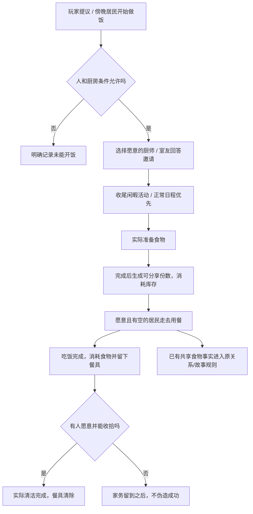

# 新人实操引导与室友共餐

日期：2026-09-06。本地实现，不代表已提交或部署。沿用共享住宅、生活行动、物品库存、关系证据与室内动画，不创建第二套游戏世界。

## 从哪里体验

1. 刷新开发页面，进入城市，打开共享住宅。
2. 住宅概况内找到「一起吃顿饭」，点击「提议室友一起吃饭」。若居民已自发张罗，则直接查看当前饭局。
3. 读每个人的回应：愿意参加、收尾后再来或拒绝。点「看看厨房」进入放大观察；返回概况查看完整经过。
4. 饭后有未完成家务时，可「问问谁愿意帮忙洗碗」。这是询问，不是强制命令。
5. 关闭面板不暂停生活；回来仍能查看进度和结果。不需要重置账号，也不需要 AI Key、额外素材或新 env。

每个住宅每个游戏日最多发起一段共餐。重复点击不会重抽居民意愿或重复发放食物。未结束的跨日饭局先处理完；新一天可再提议。

## P0：不再猜向导下一步

- 向导卡明确区分：认识居民、暂无故事、现场参与、等待结果、历史回顾、确认结果。
- 历史故事按钮明确写「回顾」，不把已经结算的事情说成正在发生。
- 事件面板底部有固定下一步操作栏，手机无需滚过人物、对白和结果才能找到按钮。
- 看完交流可记录观察或跳到帮助选项；已见证但未结算时明确说明可以先逛城市。
- 引导回顾时点击「查看结果」，随后点击「我看到了后果 · 完成引导」。普通片段看完自动标为已看，不需要手动保存 NPC 记忆。
- 打开引导故事前先等服务端绑定完成，避免打开与观察请求抢跑；命令执行期间收到刷新请求会排队补刷。
- 没有双人故事时可前往住宅，提议共餐。不伪造故事或直接修改教程为完成。

## P1：行动、物件与结果对应

### 居民意愿与时间

- 根据实际是否在家、饱腹、疲惫、私人活动、性格/独处偏好回答邀请；不会把在办公室或睡觉的人直接搬到厨房。
- 愿意参加的人有 45 秒收尾窗口，之后可以自主暂停可中断的闲暇阅读、兴趣、电视或休息。走路中、工作/学习安排、睡眠、已接受的约会、紧急需求、进行中的冲突仍优先。
- 原行动通过现有 interrupted/substitute 路径结束，不获得“完成原行动”的奖励。
- 新接下的共餐准备、吃饭、清洁分别采用 180 / 120 / 90 秒的生活行动变体；住宅内就近移动最多 12 秒。已经开始的普通做饭不会被偷改成已完成。
- 愿意来的人会短暂等待上桌；吃完可稍坐等同伴，等待次数有上限，不无限锁住 NPC，也不反复刷需求奖励。
- 固定条件验收中的两人饭局约 9 分钟完成，不保证每个阵容都准时开饭或收拾。受日程/需求阻挡的饭局有 2 小时期限；饭后善后最多等待 45 分钟，然后如实记录未完成事项。

### 食物与后果

- 只有 `prepare_food` 完成后才生成饭菜；新增份数按每份 3 单位厨房库存计算，库存不足不生成无限份数。
- 共餐厨师已经同意分享，关联饭菜明确记为 shared，并标注 `dinner_id`；愿意参加者优先取这一顿的份数。
- `eat` 完成时才消耗份数并记录谁吃过；拒绝邀请不触发好感惩罚。
- 实际清洁行动完成后才记为收拾完成；没人愿意或没有时间，餐具依旧留在住宅。
- 双人同场吃饭标记来自两人的 performing 行动；不把不在场者写成已经参加。
- 共餐本身不发统一好感奖励。既有 `shared_food` 事实继续走碰撞、关系证据与生活故事规则，避免本模块重复结算关系。
- 叙事台词是基于事实的英中模板，不调用 DeepSeek；它们描述承诺与发生的事情，不能反向生成库存、动作或关系结果。

## 数据与接口

- 世界状态 `household_dinners[household_id]` 保存当前/最近一次饭局，和既有世界版本一起事务持久化。
- `household.life.dinner` 返回公开阶段、邀请回应、时间线、实际用餐者、余下份数、餐具与清洁者；不暴露隐藏需求数值、人格分数或私人资源。
- `POST /api/v1/households/{household_id}/dinner`：`{"action":"propose"}` 或 `{"action":"cleanup"}`。
- 验证登录、入住完成和住宅归属。命令按饭局幂等；重复提议不新建，重复请求清洁不再问一遍。客户端不能传厨师、参与者、奖励或成功状态。
- 现有世界轮询/定时推进提供更新；断线与离线推进使用相同模拟转换，不由浏览器计时器直接完成动作。

## 测试与边界

- 后端 `tests/test_dinner.py`：11 项新增测试，覆盖拒绝/延后、实际库存和餐具链、重复请求、过期、闲暇收尾、工作保护、在线离线一致、跨账号隔离和跨设备恢复。
- 全量后端 502 项通过；前端 lint/typecheck/build 通过。
- `node web/scripts/check-practice-dinner-browser.mjs`：隔离 Chrome + 本地 Vite，检查手机固定引导按钮、回顾→结果→完成、共餐各阶段和事实计数、中英文与厨房放大入口；不写真实账号数据。
- 无账号验收页 `/scripts/fixtures/practice-dinner.html`。共餐快照由 `backend/scripts/export_dinner_qa.py` 在内存数据库中使用真实引擎生成，选择框只用于跳看验收快照，生产界面没有快进/直接成功按钮。
- 本轮未新增骨骼资源，也未完成精细咀嚼、双手传盘、菜品多样化、通用多人避让或全餐桌定制剧情。继续复用上轮的坐下/起身、吃饭、台面动作与道具。可验证的重点是行为连续、意愿、物件状态和可见后果。
